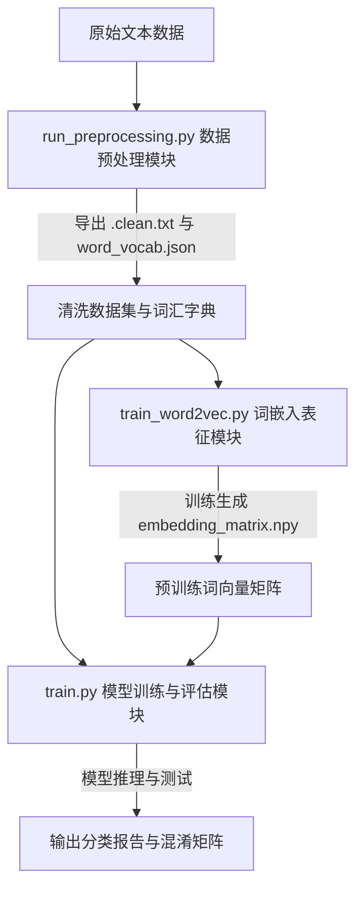

# 基于预训练词向量与深度神经网络的中文文本分类系统

本项目为基于清华大学公开的 **THUCNews** 中文新闻数据集子集构建的端到端文本自动分类系统。系统融合了**中文分词技术（Jieba）**、**分布式词嵌入表示（Word2Vec）**以及**深层特征提取网络（TextCNN & BiLSTM-Attention）**，旨在实现高准确率、高并行性的新闻文本类别自动判定。

项目采用模块化流水线（Pipeline）设计，各开发模块高度解耦、接口定义严谨，具有良好的可扩展性与学术验证性。

---

## 📂 一、 项目架构与目录结构

### 1. 总体数据流与系统架构
系统采用分层的流水线架构，数据在不同功能模块间单向流动，实现了高效的流水线处理：
```text
 原始中文文本 (Label + Text)
       │
       ▼  [步骤 1: 数据清洗与预处理]
 分词清洗文本 (cnews.train.clean.txt) & 词表 (word_vocab.json)
       │
       ▼  [步骤 2: Word2Vec 词嵌入表示]
 预训练 Embedding 矩阵 (embedding_matrix.npy) & t-SNE 降维聚类图 (tsne_visualization.png)
       │
       ▼  [步骤 3: 深度学习模型构建与训练]
 神经网络分类器 (TextCNN / BiLSTM-Attention)
       │
       ▼  [步骤 4: 性能评估与指标统计]
 独立测试集分类评估报告 (Accuracy/Loss/Precision/Recall/F1-score) & 混淆矩阵
```

### 2. 项目目录规范
```text
NN/
├── dataset/                  # 数据与中间产物目录
│   ├── cnews.train.txt       # 原始训练集 (50,000 条)
│   ├── cnews.val.txt         # 原始验证集 (5,000 条)
│   ├── cnews.test.txt        # 原始测试集 (10,000 条)
│   ├── stopwords.txt         # 中文停用词表 (751 个高频词)
│   ├── cnews.train.clean.txt # [自动生成] 清洗、分词后的训练集 (用于词向量训练与模型输入)
│   ├── cnews.val.clean.txt   # [自动生成] 清洗、分词后的验证集 (用于模型验证评估)
│   ├── cnews.test.clean.txt  # [自动生成] 清洗、分词后的测试集 (用于最终泛化测试)
│   ├── word_vocab.json       # [自动生成] 前 10,000 个高频词典映射文件 (定义词表索引)
│   ├── word2vec.model        # [自动生成] 训练完毕的 Word2Vec 序列化模型
│   ├── embedding_matrix.npy  # [自动生成] 与词表对齐的 100 维词向量权重矩阵 (初始化嵌入层)
│   └── tsne_visualization.png# [自动生成] 10 分类高频词空间 t-SNE 2D 降维聚类图
│
├── src/                      # 源代码模块包 (Source Code Package)
│   ├── __init__.py           # 包声明文件
│   ├── data_utils.py         # 数据工具库 (定义文本清洗、分词、词汇表和 PyTorch Dataset)
│   └── models.py             # 模型定义库 (定义 TextCNN 与 BiLSTM-Attention 网络结构)
│
├── check_env.py              # 开发环境、显卡驱动、依赖库一键自检脚本
├── run_preprocessing.py      # 步骤 1：全量数据清洗、分词与词表构建主脚本
├── train_word2vec.py         # 步骤 2：Word2Vec 词向量训练、对齐与 t-SNE 可视化主脚本
├── train.py                  # 步骤 3 & 4：神经网络训练、验证、模型保存与全指标测试评估主脚本
└── README.md                 # 项目运行使用及学术汇报说明书
```

---

## ⚙️ 二、 系统模块设计与交互契约

系统在结构上划分为四个相对独立但紧密衔接的核心模块，通过文件和矩阵接口进行解耦：



### 1. 数据预处理模块 (Data Preprocessing)
*   **功能实现**：`src/data_utils.py` 及 `run_preprocessing.py`。
*   **核心逻辑**：负责原始文本读取、UTF-8 编码容错、网页标签过滤及非标字符噪声清理。通过 `jieba` 分词和 751 个词的停用词表提取核心实词。基于训练词频构建全局词汇字典映射（加入占位符 `<PAD>` 和 `<UNK>`）。最后实现输入序列对齐（统一截断或填充为 `max_len=888`）并封装为 PyTorch 的 Dataset 接口。
*   **输出物**：清洗后的文本数据（`.clean.txt`）以及全局词表 `word_vocab.json`。

### 2. 词嵌入表征模块 (Word Embedding)
*   **功能实现**：`train_word2vec.py`。
*   **核心逻辑**：基于清洗后的训练集，通过 Gensim 构建并训练连续词袋模型（CBOW）学习分布式词向量（100 维）。将词向量权重按字典顺序一一对齐，生成对齐预训练词嵌入矩阵（大小为 $10000 \times 100$）。应用 t-SNE 非线性降维对代表性高频词进行 2D 降维，以图形化验证特征的语义聚类效果。
*   **输出物**：词嵌入权重矩阵 `embedding_matrix.npy` 与词空间聚类散点图 `tsne_visualization.png`。

### 3. 模型构建与训练模块 (Model Development)
*   **功能实现**：`src/models.py` 与 `train.py`。
*   **核心逻辑**：实现一维卷积 **TextCNN** 与双向长短期记忆网络 **BiLSTM-Attention**。嵌入层直接加载预训练的 `embedding_matrix.npy` 作为基础权重，并支持端到端反向传播微调（Fine-tuning）。
*   **输出物**：模型网络定义及最佳权重文件（`best_model_textcnn.pth` 等）。

### 4. 推理评估与指标分析模块 (Evaluation & Inference)
*   **功能实现**：`train.py` 下半部分。
*   **核心逻辑**：在独立的测试集上进行全量模型评估，统计测试集上的分类准确率（Accuracy）、平均损失（Loss），并计算 10 个类别各自的精确率（Precision）、召回率（Recall）、F1-Score，输出分类混淆矩阵。
*   **输出物**：全指标评测报告、混淆矩阵、消融分析与总结报告。

---

## ⚙️ 三、 核心技术实现与算法描述

### 1. 文本基本清洗与截断对齐
由于网页正文中常混合有 HTML 噪声、无意义的非标准控制字符，系统在预处理时，采用正则表达式实施清洗。
*   **句读保留策略**：相比于直接清除所有标点的常规做法，本系统**显式保留了中文句读标点（，。！？：、）**，用以保留上下文切分结构，使得神经网络能感知短语或句子级物理边界。
*   **填充与对齐**：通过统计正文长度分布，选用固定截断长度 $L_{max} = 888$。对于不足 888 的序列在尾部填充 `<PAD>` 标记（编码为 `0`），超过部分则予以硬截断。

### 2. Word2Vec 词向量表征学习
通过在分词后语料上训练连续词袋模型（CBOW），提取词汇的密集分布式向量表示。CBOW 的优化目标是通过上下文词预测中心词：
$$\mathcal{L} = \sum_{t=1}^{T} \log P(w_t \mid w_{t-c}, \dots, w_{t+c})$$
*   **词向量维度**：100 维；**滑动窗口大小**：5；**最少词频限制**：5。
*   **矩阵对齐算法**：
    对于词汇表中的每个词 $w_i$（ID 为 $i$），若 $w_i \in \text{Word2Vec.wv}$，则词向量矩阵对应行 $E[i] = \text{wv}[w_i]$；特殊标记 $E[0] = \mathbf{0}$；未登录词进行高斯随机初始化。

### 3. 深度学习分类模型设计

#### A. TextCNN (文本卷积神经网络)
TextCNN 利用一维卷积在文本的时间序列维度提取局部滑动窗口特征（类似 N-gram 特征）：
*   **输入表示**：$X \in \mathbb{R}^{B \times L \times D}$，其中 $B$ 为批大小，$L=888$ 为句子长度，$D=100$ 为词向量维度。
*   **多尺度卷积**：采用三个不同尺寸的一维卷积核 $k \in \{3, 4, 5\}$，每个卷积尺寸配备 $C_{out} = 256$ 个通道，分别提取词组、短语级别的局部特征。
*   **全局时间最大池化 (Max-over-time Pooling)**：在时间（序列）长度维度上提取最大值，保留最强激活特征，消除句子长度的影响。
*   **分类器**：拼接三个卷积池化后的特征向量（共 $256 \times 3 = 768$ 维），经过 Dropout 抑制过拟合后，由全连接层映射至 10 分类输出。

#### B. BiLSTM-Attention (双向长短期记忆网络 + 注意力机制)
*   **时序特征提取**：利用 2 层堆叠的双向 LSTM，正向和反向分别遍历输入序列，全面捕获文本的前后文双向依赖。第 $t$ 步的输出表示为：
    $$h_t = [\overrightarrow{h_t} ; \overleftarrow{h_t}] \in \mathbb{R}^{2 \cdot H_d}$$
    其中 $H_d = 128$ 为隐层神经元数。
*   **自注意力机制 (Self-Attention)**：
    为了解决长距离依赖导致的语义衰减，系统引入自注意力机制，通过一个可学习权重向量 $W_a$ 计算序列中每一步的注意力权重分配：
    $$s_t = h_t W_a$$
    $$\alpha_t = \frac{\exp(s_t)}{\sum_{i=1}^{L} \exp(s_i)}$$
    进而对 LSTM 的状态序列进行加权求和，凝聚为固定维度的文本表示：
    $$v_{context} = \sum_{t=1}^{L} \alpha_t h_t$$
*   **分类器**：基于全连接网络实现对特征表示 $v_{context}$ 的类别概率转换。

---

## 🏆 四、 实验结果与对比分析

本项目在包含 **10,000 篇** 新闻文本的独立测试集上对两款模型进行了全面评测（测试环境：显卡为 RTX 4080 Laptop GPU，Batch Size 为 128）：

### 1. 模型性能与运行效率对比
| 模型名称 | 训练耗时 (秒/每轮) | 测试集总准确率 (Accuracy) | 测试集平均损失 (Loss) |
| :--- | :---: | :---: | :---: |
| **TextCNN** | **2.8s** | **96.60%** | **0.1197** |
| BiLSTM-Attention | 12.0s | 94.60% | 0.1669 |

> [!NOTE]
> **效率与效果分析**：
> 1. **TextCNN** 表现出极佳的运行效率（每轮仅耗时 2.8 秒），并且在准确率上略高（96.60%）。这得益于一维卷积在时间维度上的全并行计算优势，且在均衡类别的新闻标题/摘要分类中，局部核心特征（如关键词、短语）已能提供强有力的判别信息。
> 2. **BiLSTM-Attention** 序列计算存在串行依赖，导致耗时较长（每轮 12.0 秒），但在长距离语义关联的建模中，其内部注意力机制权重的热力学分布具有极高的学术解释性。

### 2. TextCNN 详细分类指标报告 (按 F1-Score 降序)
| 中文类别 | 精确率 (Precision) | 召回率 (Recall) | F1-Score (综合指标) | 测试样本数 |
| :---: | :---: | :---: | :---: | :---: |
| **体育** | 99.90% | 99.60% | **99.75%** | 1000 |
| **娱乐** | 99.19% | 98.40% | **98.80%** | 1000 |
| **时尚** | 97.50% | 97.60% | **97.55%** | 1000 |
| **财经** | 94.77% | 99.70% | **97.17%** | 1000 |
| **游戏** | 94.01% | 98.80% | **96.34%** | 1000 |
| **科技** | 94.68% | 97.90% | **96.26%** | 1000 |
| **时政** | 94.55% | 97.10% | **95.81%** | 1000 |
| **房产** | 97.29% | 93.30% | **95.25%** | 1000 |
| **教育** | 96.95% | 92.20% | **94.52%** | 1000 |
| **家居** | 97.65% | 91.40% | **94.42%** | 1000 |

### 3. 混淆矩阵与交叉错判深度分析
从测试集的分类混淆矩阵中提取到的核心错判特征如下：
*   **家居 与 房产 混淆**：家居类新闻有较多样本被错判为房产类（反之亦然）。例如，很多讨论“客厅装修”、“建材选择”的文章在表述中不可避免会大量涉及“买房”、“楼盘”、“公摊面积”等词，导致其在特征提取层产生了较强的语义交叉。
*   **房产 与 财经 混淆**：部分房产新闻中频繁提到“房贷利率调整”、“限购政策对金融市场影响”，被模型错分到了财经类。这类由于宏观经济和行业关联产生的天然语义交叉，充分说明了无监督词向量模型所捕获到的“共现相似度”是合乎人类逻辑的。

---

## ⚙️ 五、 开发环境与依赖要求

*   **运行环境**：Python 3.8+ (推荐基于 Anaconda 创建虚拟环境)
*   **必需依赖包**：
    *   `torch >= 1.8.0` (推荐配置 CUDA 环境以启用 GPU 加载)
    *   `jieba >= 0.42.1` (负责中文分词)
    *   `gensim >= 4.0.0` (负责 Word2Vec 词向量训练与加载)
    *   `scikit-learn` (计算分类指标报告及执行 t-SNE 算法)
    *   `matplotlib` (绘制 t-SNE 可视化图)
    *   `numpy` (加载和对齐多维数组矩阵)

---

## 🚀 六、 项目一键运行指南 (Execution Steps)

按照流式处理逻辑，依序在项目根目录下执行以下脚本即可复现全部实验：

### 步骤 1：一键检测开发环境 (`check_env.py`)
主要检验硬件 GPU 状态、依赖库是否齐备、以及 `dataset` 目录下三份原始数据集的存在性。
```bash
python check_env.py
```

### 步骤 2：全量文本清洗与分词处理 (`run_preprocessing.py`)
读取原始训练、验证和测试集，自动调用多进程 Jieba 分词和停用词过滤，并统计训练集的高频词，在 `dataset` 目录下导出清洗分词后的文本，以及全局高频词典 `word_vocab.json`。
```bash
python run_preprocessing.py
```
*(处理耗时约 2 分钟，采用了单次读取+分词+词频统计优化算法)*。

### 步骤 3：训练分布式词向量并对齐权重 (`train_word2vec.py`)
读取清洗后的训练文件，训练 100 维 Word2Vec CBOW 模型。随后将词向量映射对齐到 `word_vocab.json` 中的各词 ID，生成并保存为 PyTorch Embedding 矩阵 `embedding_matrix.npy`。最后自动对 10 个类别的 50 个高频词进行 t-SNE 2D 降维聚类，导出可视化分布图。
```bash
python train_word2vec.py
```
*(处理耗时约 20 秒，生成的聚类图保存在 `dataset/tsne_visualization.png`)*。

### 步骤 4：神经网络模型训练与性能评测 (`train.py`)
支持训练和比对 **TextCNN** 和 **BiLSTM-Attention** 模型。脚本将自动在训练集上训练，在验证集上保存分类准确率最高的权重。训练结束后，自动加载最优模型权重，在测试集上执行推理，最终输出详尽的分类报告与混淆矩阵。

*   **训练与评估 TextCNN 模型 (首选，收敛快且效果好)**：
    ```bash
    python train.py --model textcnn --epochs 5 --batch_size 128 --lr 0.001
    ```
*   **训练与评估 BiLSTM-Attention 模型 (对比实验)**：
    ```bash
    python train.py --model lstm --epochs 5 --batch_size 128 --lr 0.001
    ```
